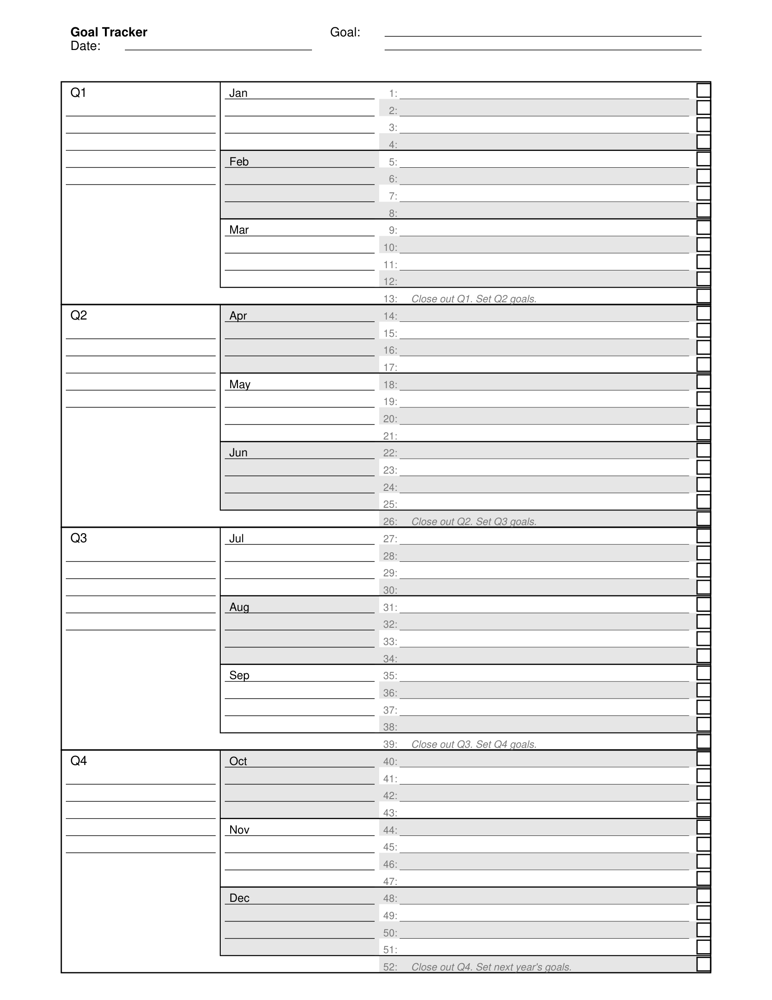

# Goal Tracker PDF Generator

A Python application that generates a printable annual Goal Tracker PDF for tracking a single goal throughout the year with quarterly, monthly, and weekly breakdowns.

## Features

- **Annual Tracking**: Track one primary goal across all 52 weeks of the year
- **Hierarchical Breakdown**: Goals organized by quarters (4), months (12), and weeks (52)
- **Printable Template**: Single-page US Letter format optimized for black/white printing
- **Customizable**: Easily adjust fonts, colors, spacing, and layout via YAML configuration
- **Professional Design**: Clean, readable layout suitable for manual tracking and reflection
- **Catch-up Weeks**: Built-in support for quarterly catch-up weeks (weeks 13, 26, 39, 52)

## Installation

### Prerequisites

- Python 3.10 or higher
- Poetry (for dependency management)

### Setup

```bash
# Clone the repository
git clone <repository-url>
cd Goal_Tracker

# Install dependencies using Poetry
poetry install

# Activate the virtual environment
poetry shell
```

The project is configured to create virtual environments in-project (see `poetry.toml`).

## Usage

### Generate PDF with Default Settings

```bash
poetry run python goal_tracker.py
```

This generates a PDF using the default configuration file (`config.yaml`) and saves it to the `output/` directory.

### Generate PDF with Custom Configuration

```bash
poetry run python goal_tracker.py --config custom_config.yaml
```

### Specify Output Filename

```bash
poetry run python goal_tracker.py --output my_goal_tracker.pdf
```

### View Help

```bash
poetry run python goal_tracker.py --help
```

## Project Structure

```
Goal_Tracker/
├── goal_tracker.py          # Main Python script
├── config.yaml              # Configuration file
├── pyproject.toml           # Poetry dependencies
├── poetry.toml              # Poetry local configuration
├── poetry.lock              # Locked dependencies (auto-generated)
├── README.md                # This file
├── LICENSE                  # License file
├── documentation/
│   └── reqs.md             # Detailed requirements and specifications
├── tests/
│   └── test_goal_tracker.py # Unit and integration tests
└── output/                  # Generated PDFs (created at runtime)
```

## Configuration

The `config.yaml` file controls all PDF generation settings:

### Page Settings

```yaml
page:
  size: letter              # US Letter (8.5" × 11")
  orientation: portrait     # Portrait orientation
  margins:
    top: 0.3               # Top margin in inches
    bottom: 0.3            # Bottom margin in inches
    left: 0.3              # Left margin in inches
    right: 0.3             # Right margin in inches
```

### Font Settings

```yaml
fonts:
  family: Helvetica        # Font family (Helvetica/Arial recommended)
  title_size: 14          # "Goal Tracker" title size
  goal_line_size: 10      # Goal input lines size
  quarter_label_size: 10  # Q1, Q2, Q3, Q4 size
  month_label_size: 9     # Jan, Feb, etc. size
  week_number_size: 8     # Week number size
```

### Color Settings

```yaml
colors:
  grid_line: [0, 0, 0]           # Black (RGB)
  light_grid: [180, 180, 180]    # Light grey (RGB)
  text: [0, 0, 0]                # Black (RGB)
```

### Layout Settings

```yaml
layout:
  quarterly_column_width: 1.75   # Width in inches
  monthly_column_width: 1.75     # Width in inches
  weekly_column_width: 3.5       # Width in inches
  checkbox_size: 0.15            # Checkbox size in inches
  row_height: 0.185              # Row height per week in inches
  weekly_line_weight: 0.3        # Thin weekly line weight
  label_padding_y: 0.07          # Vertical padding for labels
```

### Output Settings

```yaml
output:
  directory: output              # Output directory
  filename: goal_tracker_template.pdf  # Default filename
```

## PDF Layout

### Header Section
- **Title**: "Goal Tracker" (compact, same size as Goal label)
- **Date**: Label "Date:" with a line for user input, placed under the title
- **Goal**: Label "Goal:" with two lines, aligned to the right of the Title/Date block
- **Spacing**: Compact header; no separator line under the header

### Column Structure (Left to Right)
1. **Quarterly Column**: Quarters (Q1-Q4) with 6 lines each for goal writing
2. **Monthly Column**: Months (Jan-Dec) with lines for monthly goals
3. **Weekly Column**: Weeks 1-52 for weekly tracking
4. **Checkbox Column**: 52 checkboxes for tracking weekly completion

### Special Features
- **52 Weeks**: One row per week of the year
- **Catch-up Weeks**: Weeks 13, 26, 39, and 52 have no month labels (monthly column is blank); weekly column shows italic guidance (e.g., "Close out Q1. Set Q2 goals.")
- **Boxes**: Each quarter and month are outlined with a box for visual grouping
- **Alignment**: Grid is horizontally centered and column content aligned to grid edges

## Layout Diagram

A simple diagram of the grid columns and relative widths:

```mermaid
flowchart LR
  Q[Quarterly (1.75")] --> M[Monthly (1.75")] --> W[Weekly (3.5")] --> C[Checkbox (0.15")]
```

Notes:
- Margins: 0.3" on all sides
- Header is compact with no separator line
- Grid is horizontally centered on the page

## Screenshot



*Generated preview of the Goal Tracker template. The actual PDF can be customized via `config.yaml`.*

## Development

### Running Tests

```bash
poetry run pytest
```

Run with coverage:

```bash
poetry run pytest --cov=goal_tracker tests/
```

### Project Modules

- **GoalTrackerConfig**: Loads and validates YAML configuration
- **LayoutManager**: Calculates positions and dimensions for all layout elements
- **DrawingHelper**: Utility functions for drawing lines, boxes, and text
- **GoalTrackerPDF**: Main PDF generation with drawing logic

### Code Quality

The code includes:
- Type hints for better IDE support and type checking
- Comprehensive docstrings for all classes and functions
- Error handling for file I/O and PDF generation
- Modular design for easy maintenance and extension

## Testing

Included tests verify:
- Configuration loading and validation
- Layout calculations (positions, widths, heights)
- Week-to-month-to-quarter mappings
- Catch-up week logic
- PDF generation and file creation

Manual testing is recommended:
- Print the PDF on a physical printer
- Verify all text is readable
- Confirm lines are aligned and usable for handwriting
- Check that checkboxes are the correct size
- Validate the layout fits on one page without cutoff

## Design Notes

- **Generic Year**: No specific year dates are included to keep the PDF reusable across years
- **Monochrome**: Black and white design optimizes for printing on any printer
- **Fonts**: Uses Helvetica/Arial which are universally available
- **Paper Format**: US Letter (8.5" × 11") is the standard for printing

## Troubleshooting

### PDF not generated
- Check that `config.yaml` exists in the current directory
- Verify the `output/` directory is writable
- Ensure all required fonts are available

### Layout issues
- Check `config.yaml` spacing and margin values
- Test with different `row_height` values if text overlaps
- Verify page dimensions match your printer settings

### Font not available
- Change `fonts.family` in `config.yaml` to an available font
- Common safe fonts: Helvetica, Arial, Times-Roman, Courier

## License

See the [LICENSE](LICENSE) file for details.

## References

This project follows the structure and design patterns of the [Habit Tracker](documentation/habit_tracker/) reference implementation, adapted for annual goal tracking instead of daily habit tracking.

## Support

For issues, feature requests, or improvements, please refer to the detailed requirements in [documentation/reqs.md](documentation/reqs.md).
